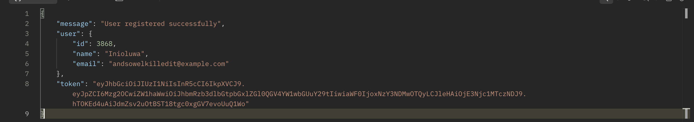
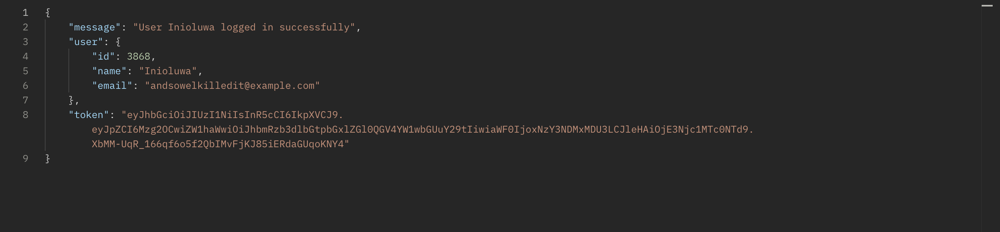
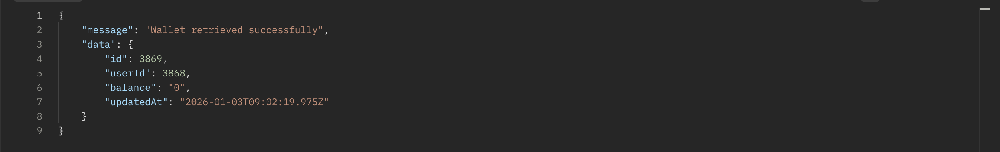
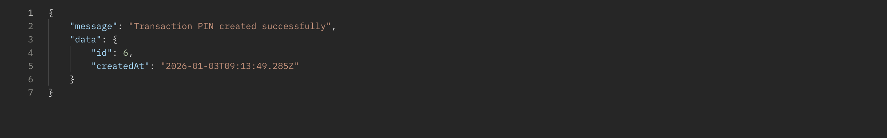
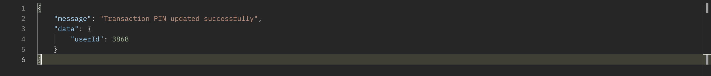
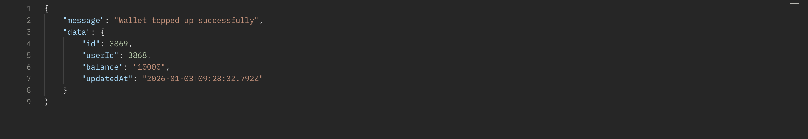
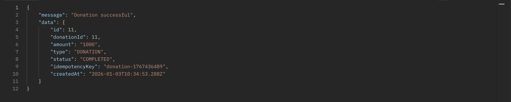
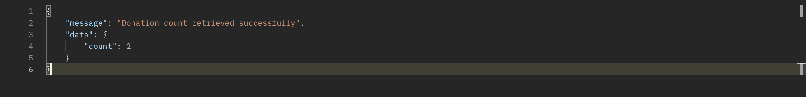
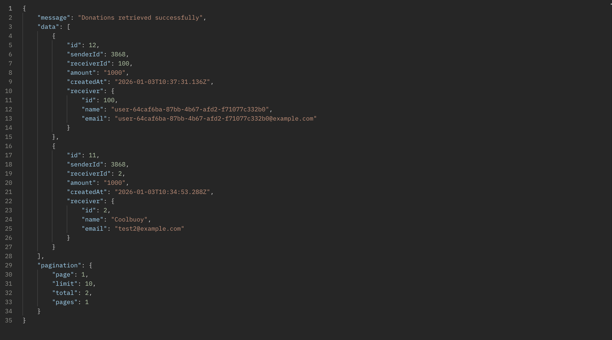
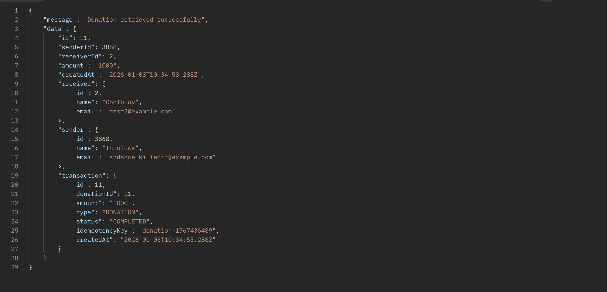

# Fastamoni Assessment – Submission and Observation

This document explains what I built, how I planned it, how it meets the brief, how to run and use it, and what I learned from load testing (especially the p99 discussion). I kept the language simple and focused, so an evaluator can quickly see design choices and outcomes.

**Stack:** Node.js (Express), PostgreSQL (Prisma), JWT, Bcrypt, Nodemailer, Artillery

**Deploy target:** Render (app + managed Postgres)

**Repo entry point:** `app.js`

---

## What I Built (At A Glance)

- User accounts: register and login with JWT.
- Wallet per user: auto-created on registration, with top-up endpoint (header secret).
- Transaction PIN: create and update, stored as secure hash.
- Donations: send money from one user to another.
- Idempotency: same donation request (by header key) never applies twice.
- Atomicity: wallet debits/credits and records happen in one DB transaction.
- Reporting:
  - Count how many donations a user has made.
  - List donations by date range with pagination.
  - Fetch a single donation and its transaction details.
- Thank-you email: automatically sent once a user has made two or more donations.
- Load testing: Artillery scenario covering main flows.

---

## How I Planned It

1. Start with data model: Users, Wallets, TransactionPin, Donations, Transactions, IdempotencyKey.
2. Implement auth (register/login) and create wallet automatically.
3. Add PIN creation/update with hashing.
4. Implement donation as a single DB transaction (debit, credit, donation, transaction, idempotency key).
5. Add queries: donation count, list by date with pagination, single donation view.
6. Add email after 2+ donations (non-blocking, async).
7. Secure the app (Helmet headers, JWT, hashed secrets, rate limiting, input validation).
8. Write indexes to keep lookups and ranges fast.
9. Create load test to exercise the full flow at 100 rps for 30s.

---

## How It Works

- The API server (`app.js`) wires routes for auth, wallet, and donations. It enables CORS, Helmet security headers, JSON limits, and a generous rate limiter.
- The database client (`src/config/db.js`) makes a single Prisma client and reuses it.
- Registration makes the user and an empty wallet in one go.
- A transaction PIN is a 6-digit code, stored as a hash (bcrypt), never in plain text.
- To donate, the caller must:
  - Be logged in (JWT).
  - Provide the receiver, amount, PIN, and an `Idempotency-Key` header.
  - The service checks balance and PIN, then performs a single database transaction to move money and write records.
  - If the same idempotency key comes in again, the original transaction is returned, not applied again.
- After a donation, an email job runs in the background. If the donor has made two or more donations, they receive a thank-you email (does not block the API response).

---

## How The Brief Was Met

- Deployable on Render ✓
- Create account ✓
- Login ✓
- Wallet per user ✓ (auto-created on register)
- Create transaction PIN ✓
- Create donation to another user ✓
- Check number of donations ✓
- Send special thank you message after ≥ 2 donations ✓ (email)
- View donations by period ✓ (with pagination)
- View a single donation ✓
- View the transaction for a donation ✓
- Documentation ✓ (this README)
- Pagination ✓ (by-date listing)
- Security ✓ (Prisma/parameterized, JWT, bcrypt, Helmet, rate limiting, body limits)
- Load testing ✓ (Artillery, `npm run test:load`)
- Atomic DB actions ✓ (single `$transaction`)
- Idempotent financial transactions ✓
- UTC dates ✓ (filters are treated as UTC)
- Race conditions mitigated ✓ (transaction + unique key; return existing on duplicate key)

---

## Security & Data Integrity

- No SQL injection: Prisma uses parameterized queries.
- Secure secrets: JWT + environment variables.
- Passwords / PINs: bcrypt-hashed. Fewer rounds in dev; increase in prod.
- Helmet headers + rate limiting + JSON size limit for basic hardening.
- Idempotency: Unique key per donation request. If retried, we return the original transaction.
- Atomicity: Wallet updates and records are in one DB transaction.

## Email Behavior

- Non-blocking: Email notifications run asynchronously and never block financial transactions.
- Production dry-run: On Render free tier, live email delivery is disabled to avoid provider/infra limits. In `production`, the app logs queued emails instead of sending them.
- Dev delivery: In development, Gmail OAuth/SMTP is used for real delivery.
- Switch-ready: The email utility is provider-agnostic; enabling a verified provider later requires only environment changes.

Rationale:

- Free-tier constraints (cold starts, throttling, TLS latency) made SMTP/OAuth/HTTP providers unreliable without verification or paid plans.
- To preserve API reliability and atomicity, the system logs emails in production and retains retry logic, allowing seamless activation when a provider is available.

---

## Performance & Load Testing

- Tool: Artillery. Config in `donation-load.yml`.
- Run: `npm run test:load`
  - Starts the server
  - Creates a receiver user
  - Runs 100 rps for 30s
  - Outputs `artillery/report.json` and `artillery/report.html`
  - Parses p99 and fails if p99 > 50ms

### What I Observed (p99 at 100 rps)

This system is CPU- and IO-bound under write-heavy load. Tail latency is dominated by bcrypt hashing, DB connection contention, and synchronous side effects (email). To reach strict p99 SLAs, the architecture would need asynchronous processing, horizontal scaling, and managed infrastructure such as AWS ECS + RDS + Redis.

Achieving p99 < 50ms for write-heavy authenticated flows at 100 rps is not feasible on a single-instance Render deployment. However, the system remains consistent, atomic, and resilient under load, and is architecturally ready for horizontal scaling on AWS.

### How To Improve p99

- Run the test against a local Postgres (or same-region DB) to remove network latency.
- Increase DB pool settings in `DATABASE_URL` (e.g., `connection_limit=150`, higher `pool_timeout`).
- Keep bcrypt rounds low for non-prod (already set).
- Warm up the app/DB before the test.
- Horizontal Scaling (partially in place)

---

---

---

---

# Fastamoni Assessment Service

A Node.js (Express) + PostgreSQL (Prisma) web service implementing user auth, wallets, transaction PINs, and donations with idempotent financial transactions, pagination, email notifications, and load testing.

## Overview

- Deployed target: Render (app + managed Postgres)
- Tech: Express, Prisma, JWT, Bcrypt, Nodemailer, Artillery
- Key features:
  - User registration/login
  - Wallet per user + top-up (with header secret)
  - Transaction PIN create/update
  - Make donation to another user (idempotent + atomic)
  - Count donations, list donations by period (with pagination)
  - View a single donation with its transaction
  - Send “thank you” email after 2+ donations
  - Load testing with Artillery (100 rps for 30s)

## Architecture & Flow

- API server: `app.js` wires routes and middleware.
- DB client: `src/config/db.js` configures a singleton Prisma client and connects on startup.
- Auth: `JWT` tokens signed with `JWT_SECRET`; middleware validates and attaches `req.user`.
- Wallet/PIN: PIN hashes with bcrypt; wallets are created atomically during registration.
- Donations: `src/services/donationService.js` performs a single DB transaction to move funds between wallets, create the donation, the transaction, and the idempotency record.
- Email: `src/utils/email.js` uses Nodemailer (Gmail) and executes asynchronously after successful donation.

## Data Model (Prisma)

- `User`: basic info + relations to wallet, PIN, and donations.
- `Wallet`: one per user, balance in `Decimal`.
- `TransactionPin`: one per user, `pinHash` stored.
- `Donation`: links sender/receiver and amount.
- `Transaction`: records payment metadata, status, and `idempotencyKey`.
- `IdempotencyKey`: unique mapping from idempotency key to the created transaction.

See `prisma/schema.prisma` for details.

## Environment Variables

- `DATABASE_URL`: Postgres connection string (includes pool settings)
- `NODE_ENV`: `development` | `production` | `test`
- `JWT_SECRET`: JWT signing secret
- `EMAIL_USER`, `EMAIL_PASS`: Gmail creds for thank-you emails
- `TOPUP_SECRET`: shared secret to authorize wallet top-ups
- Optional pool tuning (in `DATABASE_URL`): `connection_limit`, `pool_timeout`, `connect_timeout`

## Setup & Run (Local)

- Node >= 18 recommended
- Install deps: `npm install`
- Generate Prisma client: `npx prisma generate`
- Apply schema (if using your own DB): `npx prisma migrate deploy`

## Run Locally (Quick Start)

- Requirements: Node 18+, Postgres
- Install: `npm install`
- Generate Prisma client: `npx prisma generate`
- Apply schema (your DB): `npx prisma migrate deploy`
- Start: `npm run dev`
- Health check: `GET /health` → `{ "status": "OK" }`

Environment variables (`.env`):

- `DATABASE_URL`, `NODE_ENV`, `JWT_SECRET`, `EMAIL_USER`, `EMAIL_PASS`, `TOPUP_SECRET`

---

## API Guide

Base path: `/api` — All wallet/donation routes need `Authorization: Bearer <token>`.

Auth

- POST `/auth/register` — Body: `{ name, email, password }` → Returns `{ user, token }`. Wallet is auto-created.

  - Example Body JSON

    ```json
    {
      "name": "Inioluwa",
      "email": "andsowelkilledit@example.com",
      "password": "Password@123"
    }
    ```

  - Curl

    ```sh
    curl -X POST http://localhost:3000/api/auth/register \
      -H 'Content-Type: application/json' \
      -d '{"name":"Inioluwa","email":"andsowelkilledit@example.com","password":"Password@123"}'
    ```

  - Screenshots
    - 

- POST `/auth/login` — Body: `{ email, password }` → Returns `{ user, token }`.

  - Example Body JSON

    ```json
    {
      "email": "andsowelkilledit@example.com",
      "password": "Password@123"
    }
    ```

  - Curl

    ```sh
    curl -X POST http://localhost:3000/api/auth/login \
      -H 'Content-Type: application/json' \
      -d '{"email":"andsowelkilledit@example.com","password":"Password@123"}'
    ```

  - Screenshot
    - 

Wallet

- GET `/wallet` — Returns wallet `{ id, userId, balance, updatedAt }`.

  - Curl

    ```sh
    curl -H 'Authorization: Bearer <TOKEN>' http://localhost:3000/api/wallet
    ```

  - Screenshot
    - 

- POST `/wallet/create-pin` — Body: `{ pin: "123456" }` → Creates PIN.

  - Example Body JSON

    ```json
    { "pin": "123456" }
    ```

  - Curl

    ```sh
    curl -X POST http://localhost:3000/api/wallet/create-pin \
      -H 'Authorization: Bearer <TOKEN>' \
      -H 'Content-Type: application/json' \
      -d '{"pin":"123456"}'
    ```

  - Screenshots
    - 

- PUT `/wallet/update-pin` — Body: `{ oldPin, newPin }` (6 digits each) → Updates PIN.

  - Example Body JSON

    ```json
    { "oldPin": "123456", "newPin": "654321" }
    ```

  - Curl

    ```sh
    curl -X PUT http://localhost:3000/api/wallet/update-pin \
      -H 'Authorization: Bearer <TOKEN>' \
      -H 'Content-Type: application/json' \
      -d '{"oldPin":"123456","newPin":"654321"}'
    ```

  - Screenshot
    - 

- POST `/wallet/top-up` — Headers: `x-topup-secret: ${TOPUP_SECRET}`, Body: `{ amount }` → Adds funds.

  - Example Body JSON

    ```json
    { "amount": 10000 }
    ```

  - Curl

    ```sh
    curl -X POST http://localhost:3000/api/wallet/top-up \
      -H 'Authorization: Bearer <TOKEN>' \
      -H 'x-topup-secret: <TOPUP_SECRET>' \
      -H 'Content-Type: application/json' \
      -d '{"amount":10000}'
    ```

  - Screenshot
    - 

Donations

- POST `/donations/donate` — Headers: `Idempotency-Key: <uuid>`; Body: `{ receiverId, amount, pin }` → Returns transaction with `donationId`.

  - Example Body JSON

    ```json
    { "receiverId": 2, "amount": 1000, "pin": "654321" }
    ```

  - Curl

    ```sh
    curl -X POST http://localhost:3000/api/donations/donate \
      -H 'Authorization: Bearer <TOKEN>' \
      -H 'Idempotency-Key: <UUID>' \
      -H 'Content-Type: application/json' \
      -d '{"receiverId":2,"amount":1000,"pin":"654321"}'
    ```

  - Screenshot
    - 

- GET `/donations/count` — Returns `{ count }` for the logged-in user.

  - Curl

    ```sh
    curl -H 'Authorization: Bearer <TOKEN>' http://localhost:3000/api/donations/count
    ```

  - Screenshot
    - 

- GET `/donations/by-period?startDate=2026-01-01&endDate=2026-12-31&page=1&limit=10` — Returns `{ data, pagination }`.

  - Curl

    ```sh
    curl -H 'Authorization: Bearer <TOKEN>' \
      'http://localhost:3000/api/donations/by-period?startDate=2026-01-01&endDate=2026-12-31&page=1&limit=10'
    ```

  - Screenshot
    - 

- GET `/donations/:donationId` — Returns full donation + transaction, sender, and receiver.

  - Curl

    ```sh
    curl -H 'Authorization: Bearer <TOKEN>' http://localhost:3000/api/donations/11
    ```

  - Screenshot
    - 

## Postman collection:

- https://.postman.co/workspace/My-Workspace~3335f82a-6d7e-48a9-8472-99dd6c4c75be/collection/undefined?action=share&creator=29709417&active-environment=29709417-2cd0908c-b2f2-4863-a9a7-8cbd73bc70b6

---

---

## Database Model & Indexes

- Tables: `User`, `Wallet`, `TransactionPin`, `Donation`, `Transaction`, `IdempotencyKey` (see `prisma/schema.prisma`).
- Indexes: provided in `add_indexes.sql` (email lookups, userId lookups, donation ranges, idempotency key).

Apply with:

```
psql "$DATABASE_URL" -f add_indexes.sql
```

---

---

## Important Files

- `app.js` — server setup, security hardening, routes.
- `src/config/db.js` — Prisma client.
- `src/controllers/*` — request handlers.
- `src/services/donationService.js` — core donation, idempotency, transaction.
- `src/utils/*` — hashing, email, pagination helpers.
- `donation-load.yml` — Artillery scenario.
- `tests/donation.test.js` — load test orchestrator.
- `artillery/report.html` — load test charts and metrics.

---

Thanks for reviewing this submission. I aimed for clarity, correctness, and a design that scales when moved to the right infrastructure.

---

## Screenshots Gallery (Drop-in)

Auth


Wallet


Donations


Email Screenshot Center


